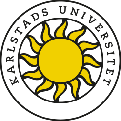

# The CAT project
This is the documentation for the Correlation Attacks against Tor (CAT) research project at [Karlstad University](https://www.kau.se/cs). 
CAT is funded largely by [the Internet Foundation in Sweden](https://www.iis.se/english/about-iis/) between fall 2018 to March 2019.

  
  

The ultimate goal of the project is to contribute to figuring out how to [effectively pad network traffic](https://arxiv.org/pdf/1512.00524.pdf) in [Tor](https://www.torproject.org/) to better resist [some types of traffic analysis attacks](https://blog.torproject.org/tors-open-research-topics-2018-edition). 
We will contribute towards this goal by investigating _correlation attacks_ against Tor and the effects of padding on these types of attacks.
